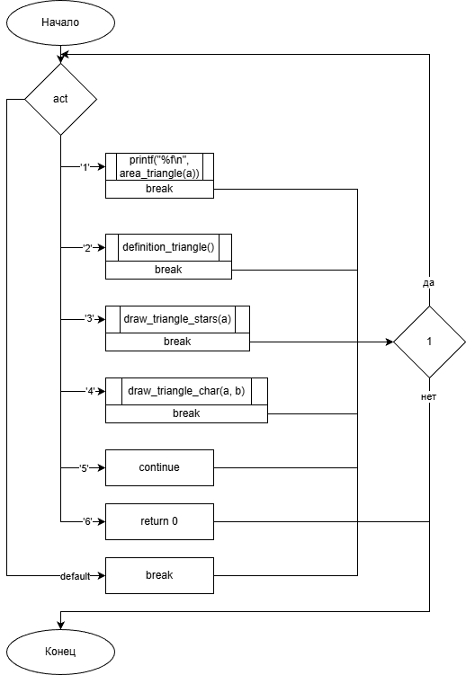
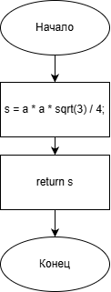
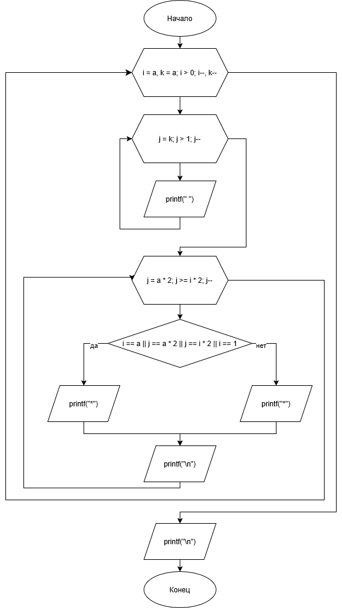

# Домашнее задание

## Условие задачи
Составьте программу, которая для заданной пользователем фигуры, например прямоугольника (треугольника или другой фигуры см. инидивидуальное задание работы 9) предлагает меню выбора одной из операций:
1. рассчитать площадь;
2. вывести определение фигуры;
3. нарисовать фигуру.1. Алгоритм и блок-схема

## Алгоритм и блок-схема

### Алгоритм

1. **Начало**
2. Инициализировать переменные;
3. Запросить у пользователя размер равностороннего треугольника;
4. Предоставить меню действий;
5. Обработать выбор пользователя;
5. Вывести результат;
6. **Конец**


### Блок-схема
- main()<br>
 <br>
- area_triangle(float a)<br>
<br>
- draw_triangle_stars(int a)<br>
<br>
[https://github.com/glebofrl/lab6VSU/blob/master/scheme1.png](https://github.com/glebofrl/lab10VSTU/blob/master/scheme1.png)
[https://github.com/glebofrl/lab6VSU/blob/master/scheme2.png](https://github.com/glebofrl/lab10VSTU/blob/master/scheme2.png)
[https://github.com/glebofrl/lab6VSU/blob/master/scheme3.png](https://github.com/glebofrl/lab10VSTU/blob/master/scheme3.png)

## 2. Реализация программы

```
#include <stdio.h>
#include <locale.h>
#include <math.h>

float area_triangle(float a);
void draw_triangle_stars(int a);
void draw_triangle_char(int a, char b);
void definition_triangle();


int main()
{
	setlocale(LC_CTYPE, "RUS");
	do {
		int a;
		char b;
		printf("Введите размер равностороннего треугольника: ");
		scanf("%d", &a);

		char act;
		printf("Выберите желаемое действие, нажав на соответствующую цифру:\n"
			"1. Рассчитать площадь треугольника.\n"
			"2. Вывести определение треугольника.\n"
			"3. Нарисовать равносторонний треугольник.\n"
			"4. Выбрать символ и нарисовать.\n"
			"5. Перезапустить программу.\n"
			"6. Завершить программу.\n");
		while (getchar() != '\n');
		act = getchar();
		switch (act)
		{
		case '1':
			printf("%f\n", area_triangle(a));
			break;

		case '2':
			definition_triangle();
			break;

		case '3':
			draw_triangle_stars(a);
			break;

		case '4':
			printf("Введите символ, из которого будет состоять треугольник: ");
			while (getchar() != '\n');
			b = getchar();
			draw_triangle_char(a, b);
			break;

		case '5':
			continue;
		case '6':
			return 0;
		default:
			printf("Некорректный ввод!\n");
			break;
		}
		printf("\n");
		while (getchar() != '\n');
	} while (1);

}

void definition_triangle() {
	printf("Правильный треугольник (равносторонний, равноугольный) — треугольник,"
		"\nу которого все три стороны равны между собой."
		"\nЕсли обозначить длину стороны буквой a,"
		"\nто для любого равностороннего треугольника можно записать: AB = BC = AC = a.");
}

float area_triangle(float a) {
	float s = a * a * sqrt(3) / 4;
	return s;
}

void draw_triangle_stars(int a) {
	for (int i = a, k = a; i > 0; i--, k--)
	{
		for (int j = k; j > 1; j--)
		{
			printf(" ");
		}

		for (int j = a * 2; j >= i * 2; j--) {

			if (i == a || j == a * 2 || j == i * 2 || i == 1)
				printf("*");
			else printf(" ");
		}


		printf("\n");
	}
	printf("\n");
}

void draw_triangle_char(int a, char b) {
	for (int i = a, k = a; i > 0; i--, k--)
	{
		for (int j = k; j > 1; j--)
		{
			printf(" ");
		}

		for (int j = a * 2; j >= i * 2; j--) {

			if (i == a || j == a * 2 || j == i * 2 || i == 1)
				printf("%c", b);
			else printf(" ");
		}


		printf("\n");
	}
	printf("\n");
}
```

## 3. Результаты работы программы


## 4. Информация о разработчике

Капичников Юрий, бИПТ-252
